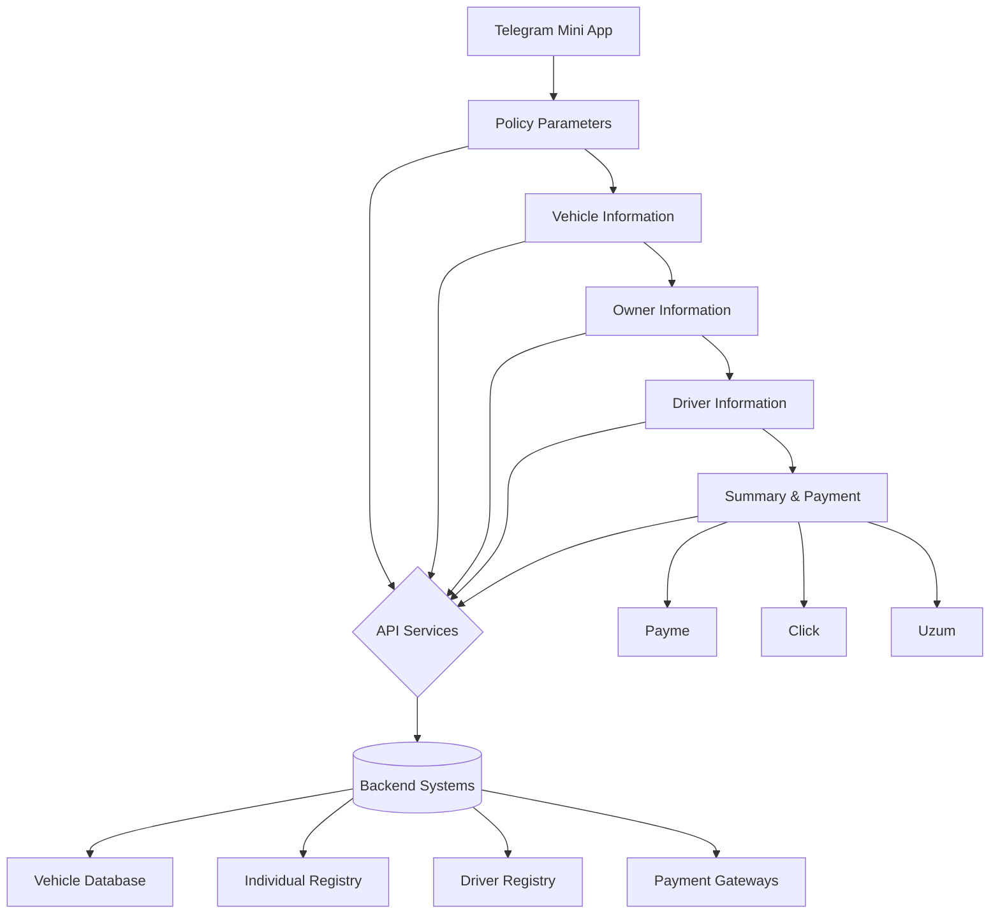

# Technical Specification: Telegram Mini App for ECCLIVO Insurance Purchase

## 1. Overview
This document describes the technical specification for developing a Telegram Mini App that replicates the ECCLIVO insurance policy purchase functionality from the existing website(source is in "website" folder). The app will guide users through a 5-step process to purchase an OSGO (Compulsory Motor Third Party Liability) insurance policy.

## 2. Functional Requirements

### 2.1 User Flow
The application will follow a 5-step process:
1. **Policy Parameters** - Select vehicle type, insurance period, driver restrictions, and usage territory
2. **Vehicle Information** - Enter vehicle details and verify in database
3. **Owner Information** - Enter owner details and verify in database
4. **Driver Information** - Add and verify driver(s)
5. **Summary & Payment** - Review policy details, enter contact information, and make payment

### 2.2 Step 1: Policy Parameters
Users will configure:
- Vehicle type selection (from predefined options)
- Insurance period (1 year, 6 months, etc.)
- Driver limitation (unlimited vs. limited)
- Incident frequency (if drivers are limited)
- Usage territory/driving area

### 2.3 Step 2: Vehicle Information
Users will:
- Enter vehicle government number
- Enter technical passport series and number
- Verify vehicle details against database
- View retrieved vehicle information (model, year, engine number, etc.)

### 2.4 Step 3: Owner Information
Users will:
- Enter owner's passport series and number
- Enter owner's birth date
- Verify owner details against database
- View retrieved personal information (name, address, etc.)

### 2.5 Step 4: Driver Information
Users will:
- Add one or more drivers
- For each driver, enter passport details and birth date
- Verify driver details against database
- View retrieved driver information (license details, address, etc.)

### 2.6 Step 5: Summary & Payment
Users will:
- Review all entered information
- Enter contact phone number
- Select policy start date
- View calculated premium amount
- Proceed to payment via Payme, Click, or Uzum

## 3. Technical Architecture

### 3.1 Frontend
- **Platform**: Telegram Mini App (Web-based)
- **Framework**: Vanilla JavaScript or lightweight framework compatible with Telegram's WebView
- **UI Components**: Custom components mimicking the website's design
- **State Management**: Local storage/session storage for form persistence

### 33.2 Backend Integration
- **API Services**: Reuse existing backend services:
  - `OsgoService.getVehicle` - Vehicle verification
  - `PartyService.getIndividualByPassport` - Owner verification
  - `OsgoService.getDriver` - Driver verification
  - `BillingService` - Payment processing

### 3.3 Data Models
The app will use the same data models as the website:
- `Osgo` - Main insurance policy object
- `Vehicle` - Vehicle information
- `Individual` - Owner/applicant information
- `Driver` - Driver information

## 4. Block Diagram

## 5. Implementation Details

### 5.1 Navigation
- Linear navigation with Previous/Next buttons
- Users can go back to edit previous steps
- Progress indicator showing current step

### 5.2 Form Validation
- Real-time validation for required fields
- Format validation for phone numbers, passport data
- Date validation for birth dates and policy dates

### 5.3 Error Handling
- Display user-friendly error messages
- Handle network errors gracefully
- Provide retry mechanisms for failed API calls

### 5.4 Data Persistence
- Save form data in session storage to prevent loss on navigation
- Clear data after successful policy creation
- Restore partially filled forms on app restart

### 5.5 Localization
- Support for Russian and Uzbek languages
- Use same translation keys as website

## 6. Security Considerations
- Secure communication with backend APIs
- Protection of personal data (passport numbers, PINFL)
- CSRF protection for payment transactions
- Input sanitization to prevent injection attacks

## 7. Performance Requirements
- Fast loading times (< 3 seconds)
- Responsive UI for mobile devices
- Efficient API usage to minimize data consumption
- Offline capability for form filling (with sync when online)

## 8. Testing Strategy
- Unit tests for business logic
- Integration tests for API interactions
- End-to-end tests for critical user flows
- Cross-browser testing on Telegram's supported browsers

This specification provides a comprehensive overview of the Telegram Mini App implementation that replicates the ECCLIVO insurance purchase flow from the website. The block diagram illustrates the key components and data flow of the system.

### SIDENOTES
1. existing website frontend source is in the "website" folder to referecence for api,endpoints, architechture, step chains, text etc.
2. website uses login page with login and pass to get token, which is used to get user data, and then used to get user data from api.This is not implemented in the mini app because miniapp uses telegram auth. But if you want to use login page, use login:998935286407 pass:Abc123!@# as a temperory solution.I will add login page in the future.
3. it would be nice if UI will be with fixed header and footer and footer will be with buttons to go to previous step and next step. Header will be with logo and title, product name progress bar.
4. while creating miniapp, make sure you follow the telegram guidelines on UI and design.

### DESIGN UI/UX
Generate a clean, professional HTML and CSS layout for a Telegram Mini App following the telegram guidelines.
HTML Structure Requirements:
- A fixed header that includes:
- A placeholder for a company logo (left-aligned)
- A product title and short description (centered or right-aligned)
- A progress bar with tabs (e.g., Step 1, Step 2, Step 3) integrated into the header or just below it
- A main content body for a form (use semantic HTML5, e.g., <main>, <form>, <section>)
- A fixed footer with navigation buttons or links (e.g., Back, Next, Help)
CSS Requirements (Theme 1 only):
- Use a minimalist but polished design—no amateurish or default-looking styles
- Include subtle animations (e.g., hover effects, progress bar transitions, tab switching)
- Use a modern font, clean spacing, and a neutral color palette (e.g., soft grays, whites, accent blue)
- Ensure responsive layout for mobile and desktop
- Place all styles in a separate CSS file (Theme 1 only for now)
Design Notes:
- Tabs and progress bar should be visually appealing and intuitive
- Avoid clutter; prioritize clarity and hierarchy
- Use flexbox or grid where appropriate
- No JavaScript needed at this stage
Output:
- One HTML file with semantic structure and placeholder content
- One CSS file (Theme 1) with clean, modular styling
Do not include additional themes yet. I will request them later.

# BEFORE YOU BEGIN
1. Research the codebase of the website ("website" folder), See the component with path /ecclivo for the reference.
2. create md file with structured plan list, check and review so i can see the progress.
3. create a block-schem or diagram(so you can reference it later) in a text form, or image. whatever you choose.

# 📱 Telegram Mini App – Best Practices & Frontend Stack (Nuxt Edition)

## ✅ Best Practices

### 1. Use Telegram’s WebApp SDK
- Integrate the [Telegram WebApp JavaScript SDK](https://core.telegram.org/bots/webapps)
- Use `initData` for secure user authentication and session validation
- Access Telegram theme settings and UI elements

### 2. Design Mobile-First
- Prioritize responsive layouts for mobile users
- Use fixed headers/footers and avoid scroll-heavy designs
- Ensure touch-friendly UI components

### 3. Keep It Lightweight
- Minimize dependencies and bundle size
- Lazy-load assets and compress images
- Avoid bloated frameworks unless necessary

### 4. Follow Telegram UI Patterns
- Use native-like buttons, progress indicators, and modals
- Respect Telegram’s light/dark themes
- Match Telegram’s visual language for consistency

### 5. Secure Your App
- Validate `initData` on the backend using Telegram’s signature verification
- Never expose sensitive logic or tokens in the frontend

---

## 🧰 Recommended Frontend Stack (Nuxt 3)

| Layer            | Recommended Tools/Tech |
|------------------|------------------------|
| **Framework**    | [Nuxt 3](https://nuxt.com/) (Vue 3 + Vite) |
| **Styling**      | Tailwind CSS, SCSS, or UnoCSS |
| **UI Components**| Headless UI for Vue, Vuetify, or custom |
| **Animations**   | VueUse Motion, Nuxt Transitions |
| **State Mgmt**   | Pinia (Nuxt-native) |
| **Telegram SDK** | Telegram WebApp SDK (vanilla JS) |
| **Deployment**   | Vercel, Netlify, or Nuxt’s CLI (`nuxi`) |

---

## 🧪 Nuxt-Specific Tips for Telegram Integration

- Use `useHead()` to dynamically set page metadata for Telegram previews
- Access Telegram’s theme with `window.Telegram.WebApp.themeParams` and bind it to Nuxt’s layout system
- Use Nuxt’s `layouts/` folder to create a fixed header/footer layout that wraps all pages
- Handle Telegram’s `initData` in a Nuxt server route (`server/api/validate.ts`) for secure validation

---
